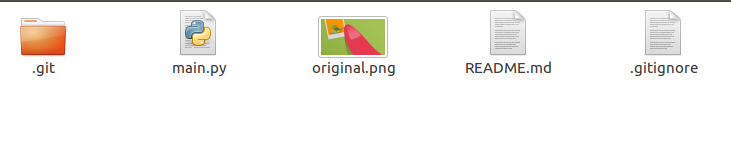
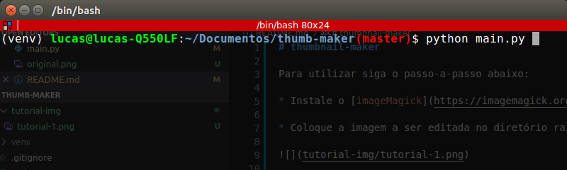
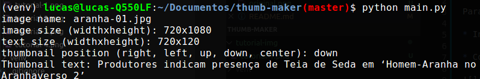
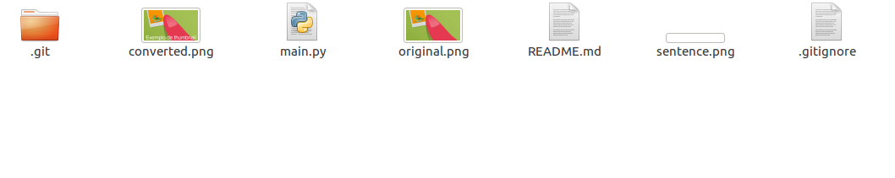

# thumbnail-maker

Para utilizar siga o passo-a-passo abaixo:

* Instale o [imageMagick](https://imagemagick.org/index.php)

* Coloque a imagem a ser editada no diretório raíz do projeto

* Execute o projeto (é recomendado utilizar python3 ou superior)

* Digite o nome da imagem a ser editada (com a extensão, ex: original.png)

* Digite o tamanho do texto da thumbnail (altura e largura)

* Digite a posição da thumbnail

* Digite o texto da thumbnail

* A imagem gerada terá o nome "converted.png" e estará no diretório raíz do projeto

### Por fim:

* Original:

* Resultado:

